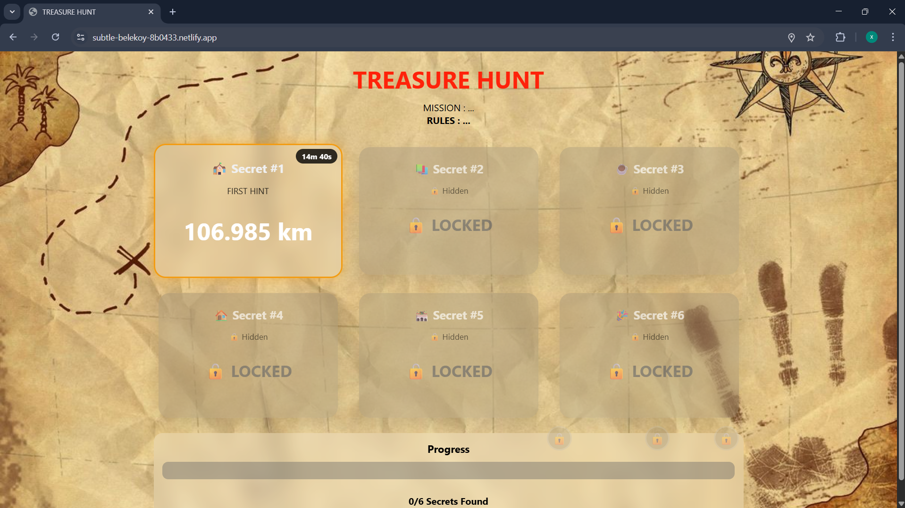

## 📸 Screenshot

# 📍 GPS Treasure Hunt System

A real-time location-based web application that allows players to unlock secrets by physically reaching GPS coordinates within a timed challenge.

Designed with persistent state reconstruction, backend-driven secrets, and Firebase integration.
---

## 🚀 Live Demo

👉 https://papaya-paprenjak-350fa3.netlify.app/

---

## 🎯 Project Overview

This application is a location-based interactive game where:

- Players must reach secret GPS coordinates
- Each location has a countdown timer
- Progress persists after page refresh
- Rewards unlock after completing milestones
- Secret locations are securely stored in Firebase (not exposed in frontend)

---

## 🛠 Tech Stack

- **Frontend:** HTML, CSS, Vanilla JavaScript  
- **Backend:** Firebase Realtime Database  
- **APIs Used:**  
  - Geolocation API  
  - Firebase SDK  
- **Hosting:** Netlify  

---

## 🔐 Key Features

### ✅ Secure Secret Locations
GPS coordinates are stored in Firebase and loaded dynamically.  
They are not visible in browser inspect tools.

### ⏳ Persistent Countdown
The timer does not reset when the page refreshes.

### 💾 State Reconstruction
After refresh:
- Completed locations remain completed
- Failed locations remain failed
- Active countdown resumes correctly

### 🎁 Reward System
Rewards unlock at:
- 4 secrets → First reward
- 5 secrets → Second reward
- 6 secrets → Final treasure

### 📡 Real-Time GPS Distance Tracking
Distance is calculated using the Haversine formula.

---

## 🧠 Architecture Overview

Frontend  
↓  
Firebase Realtime Database  
↓  
Secret Locations / Game Progress  

Game state structure:

secretLocations/{id}  
gameProgress/{secretId}  

LocalStorage is used for temporary persistence and refresh recovery.

---

## 📂 Project Structure

gps-treasure-hunt/
│
├── frontend/
│   └── index.html
│
├── README.md
└── .gitignore

---

## ⚙️ How To Run Locally

1. Clone the repository:
   git clone https://github.com/ayoxic/gps-treasure-hunt.git

2. Open the project folder

3. Deploy using:
   - Netlify
   - Firebase Hosting
   - Or a local HTTPS server

⚠️ Geolocation requires HTTPS in most browsers.

---

## 🔥 Future Improvements

- Firebase Authentication
- Server-side GPS validation (Cloud Functions)
- Admin monitoring dashboard
- Multiplayer mode
- Leaderboard system
- Anti-GPS spoofing protection

---

## 📈 What This Project Demonstrates

- Real-time state management
- Backend integration with Firebase
- Secure data handling
- Persistent UI reconstruction
- GPS-based application logic
- Reward system architecture

---

## 👨‍💻 Author

Ayoub  
Data & Software Engineering Student
